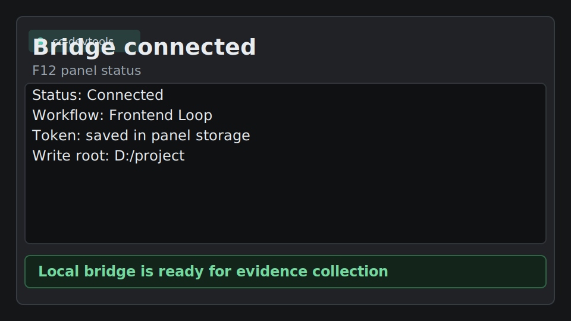
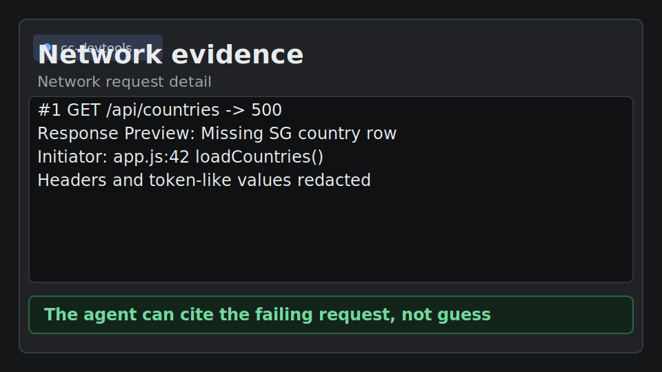
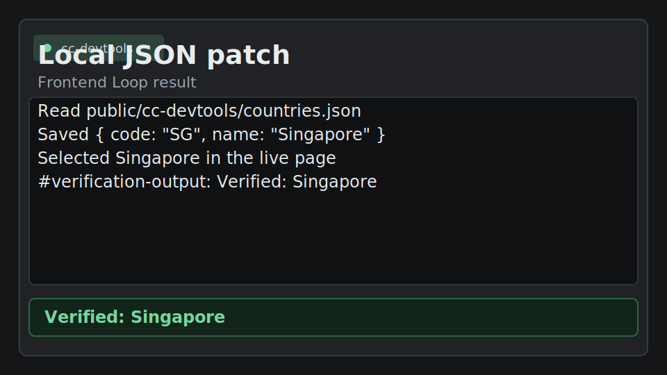

# cc-devtools

[](https://github.com/xuqinghuan675/cc-devtools/actions/workflows/ci.yml)
[](LICENSE)
[](pyproject.toml)
[](https://developer.chrome.com/docs/devtools)

Connect any CLI agent to Chrome F12 DevTools.

| Bridge connected | Network evidence | JSON patched and verified |
|---|---|---|
|  |  |  |


cc-devtools lets Claude Code, Codex, local LLM CLIs, and other terminal AI tools chat inside F12, inspect live web pages, read console and network evidence, understand the local frontend project, click/type on the page, generate selectors, and patch local frontend files.

> Instead of copying DOM, console errors, network failures, and source snippets into an AI chat, let the AI gather the evidence from DevTools.

## Why This Instead of Another Browser Tool

- **No new API key**: use the CLI AI you already run, including Claude Code, Codex, local LLM CLIs, or custom terminal agents.
- **Any CLI AI inside F12**: the bridge speaks WebSocket to the DevTools panel and stdin/stdout to your agent, so it is not tied to one hosted model vendor.
- **DevTools-native evidence**: page text, DOM, console, network, selectors, and local frontend context arrive in one chat surface.
- **Different from MCP-only flows**: MCP servers are good tool backends; cc-devtools puts the operator UI directly inside Chrome F12.
- **Different from Playwright MCP**: Playwright is strongest for scripted automation; cc-devtools is optimized for interactive debugging, local file patching, and browser verification loops.
- **CDP without writing CDP glue**: users can ask for inspection, selectors, clicks, inputs, and verification without hand-writing Chrome DevTools Protocol scripts.

[中文 README](README_CN.md) · [Quickstart](docs/QUICKSTART.md) · [Demo script](docs/DEMO_SCRIPT.md) · [Use cases](docs/USE_CASES.md) · [Security](SECURITY.md) · [Contributing](CONTRIBUTING.md)

## Why Developers Use It

- **Debug faster**: collect Console, Network, DOM, and page text in one workflow.
- **Chat directly in F12**: the panel can attach current page context before each normal chat message.
- **Work in a polished DevTools panel**: compact workflow controls, action reference, readable chat output, and safer local-file actions stay in one F12 surface.
- **Make AI useful for non-visual models**: the page becomes structured text and actions.
- **Understand your frontend first**: Frontend Loop automatically attaches a local project scan covering `package.json`, scripts, framework, bundler, configs, key directories, data/service candidates, and likely entry files.
- **Let the agent operate the page**: click buttons, fill inputs, press keys, and verify the visible result.
- **Generate stable selectors**: ask for Playwright/CSS selectors based on the live DOM.
- **Patch local frontend data**: add options such as a new country by writing local JSON and updating the frontend data path.
- **Stay local-first**: the bridge runs on `localhost`; your chosen CLI AI decides whether inference is local or cloud.

## 30-Second Demo

Run the bundled demo:

```bash
cc-devtools-demo
cc-devtools-demo --live
```

`--live` starts both the demo page and bridge, then opens the page in your default browser. If the browser does not open automatically, open `http://localhost:5173` yourself.

Press F12, choose **Frontend Loop**, click **Copy prompt** on the demo page, then ask:

```text
Add Singapore to the country selector. Use the local JSON file, then select it and verify it in the page.
```

The agent can:

1. Inspect the country selector in the live page.
2. Use the automatically attached project scan to understand files, scripts, and data candidates.
3. Read `public/cc-devtools/countries.json`.
4. Save Singapore into the local JSON file.
5. Reload the page data.
6. Select Singapore and click **Verify**.
7. Report `#verification-output` as browser evidence.

## How It Works

```text
Chrome F12 Panel
   <-> WebSocket ws://localhost:9876
      <-> cc-devtools bridge
         <-> CLI AI command, for example cc -p

The panel exposes DevTools actions:
DOM, text, eval, console, network, page click/input/press, project scan,
file list/read, and opt-in local writes.
```

cc-devtools does not require its own API key. It starts your configured CLI AI command and sends it structured page context plus workflow instructions.
The panel also sends a CLI permission mode with each message. The default is `auto`; choose `plan` for planning-only sessions or `bypassPermissions` only for trusted disposable sandboxes.

## Quick Start

### Windows: two steps

1. Download or clone this repository, then double-click `install.bat`.
   The installer installs the Python bridge, generates a local bridge token, detects `cc` or `claude`, stops any old bridge already using port `9876`, starts `start-bridge.bat`, opens `chrome://extensions`, and opens the local `extension` folder.
2. In Chrome, enable **Developer mode**, click **Load unpacked**, and select the opened `extension` folder.

Then open any web page, press **F12**, choose the **cc-devtools** tab, paste the token printed by `install.bat` or `start-bridge.bat` into the panel **Token** field, click **Save**, and chat.

### CLI install

```bash
pip install git+https://github.com/xuqinghuan675/cc-devtools.git
cc-devtools
cc-devtools-path
```

Use the CLI path when you want to start the bridge manually from a specific frontend project directory.

For screenshots, troubleshooting, and detailed Windows steps, see [docs/QUICKSTART.md](docs/QUICKSTART.md).

## Workflow Modes

| Mode | Use it when you want to |
|---|---|
| Inspect | Understand page structure, content, forms, buttons, and key UI flows |
| Debug | Diagnose console errors, failed requests, broken buttons, or missing data |
| Selector | Generate stable Playwright locators and CSS selectors |
| QA | Run a lightweight release checklist against the live page |
| Local Data Patch | Read/write local project files and make the frontend use local mock data |
| Frontend Loop | Run the full live-page -> auto project context -> file-patch -> browser-verification loop |

The workflow prompts live in [`cc_devtools/skills/frontend-devtools-workflows`](cc_devtools/skills/frontend-devtools-workflows/SKILL.md).

## CLI Permission Modes

| Mode | What it sends to the CLI |
|---|---|
| Auto | `--permission-mode auto` (default) |
| Plan | `--permission-mode plan` |
| Bypass | `--permission-mode bypassPermissions` |

The permission-mode dropdown does not enable local file writes. `[ACTION:save]` / `write_file` still require `CC_DEVTOOLS_ENABLE_WRITE=1` in both the Python bridge and the Node bridge.

Action execution stays lightweight by default: read-only actions run automatically, `click` / `input` / `press` continue to work in Auto mode, and only higher-risk `eval`, `save`, `file:read`, `storage:set`, and `storage:remove` ask for panel confirmation. Plan mode blocks mutating actions; Bypass mode skips panel confirmation but does not bypass bridge write-root, sensitive-file, or `CC_DEVTOOLS_ENABLE_WRITE` checks.

## Actions

| Action | Description |
|---|---|
| `[ACTION:eval]code[/ACTION]` | Execute JavaScript on the inspected page |
| `[ACTION:dom]selector[/ACTION]` | Return the first matched element's `outerHTML` |
| `[ACTION:dom:all]selector[/ACTION]` | Return paginated matching elements |
| `[ACTION:dom:all]{"selector":"button","offset":0,"limit":25,"format":"summary"}[/ACTION]` | Return paginated DOM summaries |
| `[ACTION:text]selector[/ACTION]` | Return visible text for an element |
| `[ACTION:click]selector[/ACTION]` | Click a matched element on the inspected page |
| `[ACTION:input]selector\ntext[/ACTION]` | Set an input-like element value and dispatch input/change events |
| `[ACTION:press]key[/ACTION]` | Send keydown/keyup events to the active element |
| `[ACTION:console][/ACTION]` | Return recent console logs |
| `[ACTION:network][/ACTION]` | Return recent network requests with stable in-session IDs |
| `[ACTION:network]{"id":1,"detail":true,"bodyLimit":12000}[/ACTION]` | Return request headers, timing, post data, and response preview |
| `[ACTION:title][/ACTION]` | Return page title |
| `[ACTION:url][/ACTION]` | Return current URL |
| `[ACTION:copy]text[/ACTION]` | Render a user-click Copy button with fallback selectable text |
| `[ACTION:storage:list]localStorage[/ACTION]` | List `localStorage`, `sessionStorage`, or visible cookie keys |
| `[ACTION:storage:get]{"area":"localStorage","key":"theme"}[/ACTION]` | Read browser storage values |
| `[ACTION:storage:set]{"area":"sessionStorage","key":"debug","value":"1"}[/ACTION]` | Write browser storage values after confirmation |
| `[ACTION:storage:remove]{"area":"cookie","key":"debug"}[/ACTION]` | Remove browser storage values after confirmation |
| `[ACTION:project:scan][/ACTION]` | Summarize local frontend framework, bundler, scripts, configs, key directories, data/service candidates, dependencies, and entry files |
| `[ACTION:file:list]pattern[/ACTION]` | List local project files under the bridge write root |
| `[ACTION:file:read]path[/ACTION]` | Read a local project file under the bridge write root |
| `[ACTION:save]path\ncontent[/ACTION]` | Write a local file under the bridge write root when `CC_DEVTOOLS_ENABLE_WRITE=1` is set |

File actions are restricted to `CC_DEVTOOLS_WRITE_ROOT`, or to the directory where you started the bridge. Sensitive files such as `.env`, private key files, `.npmrc`, and `.git/config` are rejected even when they are under the write root.

## Install From Source

```bash
git clone https://github.com/xuqinghuan675/cc-devtools.git
cd cc-devtools
pip install -e .
cc-devtools
```

Node bridge alternative:

```bash
cd bridge
npm install
node server.js
```

The Node bridge is an alternative path, but it follows the same default `auto` permission mode, `CC_DEVTOOLS_TOKEN` check when configured, sensitive-file rejection, and explicit `CC_DEVTOOLS_ENABLE_WRITE=1` write gate.

## Configuration

| Environment variable | Default | Description |
|---|---|---|
| `CC_DEVTOOLS_CMD` | `cc` | CLI AI command to run |
| `CC_DEVTOOLS_PORT` | `9876` | Local WebSocket port |
| `CC_DEVTOOLS_WRITE_ROOT` | current working directory | Directory where file actions may read and, when enabled, write |
| `CC_DEVTOOLS_ENABLE_WRITE` | unset | Set to `1` to enable `[ACTION:save]` / `write_file` |
| `CC_DEVTOOLS_PERMISSION_MODE` | `auto` | Default CLI permission mode when the panel does not send one; allowed values include `auto`, `plan`, and `bypassPermissions` |
| `CC_DEVTOOLS_TOKEN` | generated by `install.bat`; otherwise unset | Shared token required by the bridge when configured |
| `CC_DEVTOOLS_ALLOWED_ORIGINS` | `chrome-extension://*` behavior | Optional comma-separated exact origins or `prefix*` patterns |
| `CC_DEVTOOLS_BYPASS` | unset | Legacy shortcut for `bypassPermissions` when the panel does not send a permission mode |

## Safety Model

- Use the extension only on pages you trust.
- Page text, DOM snippets, console logs, network summaries, and action results are sent to your CLI AI process.
- Browser-originated context is marked as untrusted prompt data before it is sent to the CLI AI.
- Token-like values in page URL, body text, DOM snippets, console logs, network URLs, and action results are redacted where they match common key names.
- `[ACTION:eval]` runs JavaScript in the inspected page.
- Page interaction actions can click, type, or press keys on the inspected page.
- `[ACTION:project:scan]` reads local project metadata under the bridge write root.
- File actions cannot leave the configured write root, and sensitive files are rejected inside the root.
- File writes are disabled by default; enable them only for disposable or trusted project roots.
- `install.bat` generates a `CC_DEVTOOLS_TOKEN`, writes it into `start-bridge.bat`, and asks you to save it in the DevTools panel. Manual bridge starts should set `CC_DEVTOOLS_TOKEN` for the same shared-token check.
- The panel defaults to Claude Code `--permission-mode auto`. Select `bypassPermissions` only when you understand the risk.
- In Auto mode, `eval`, `save`, and `file:read` require panel confirmation; `click`, `input`, and `press` remain automatic for frontend verification workflows.
- Automatic action-result loops stop after five rounds per user message.
- The DevTools panel escapes ordinary assistant HTML before rendering action blocks.

Read the full policy in [SECURITY.md](SECURITY.md).

## Project Status

cc-devtools is early-stage alpha. The Python bridge is the primary path; the Node bridge is kept as an alternative for users who prefer Node.js.

Good first issues:

- Demo GIF or screenshots for common workflows
- More framework-specific local data patch examples
- Stronger click/input verification examples for React, Vue, Next.js, and Vite apps
- Chrome extension polish and UI accessibility improvements

## Related Ideas

cc-devtools is inspired by the same developer pain that tools like Chrome DevTools, Local Overrides, Playwright locators, and browser-agent integrations address: agents need live browser evidence, not pasted screenshots.

Useful references:

- [Chrome DevTools documentation](https://developer.chrome.com/docs/devtools)
- [Chrome DevTools Local Overrides](https://developer.chrome.com/docs/devtools/overrides)
- [Playwright locators](https://playwright.dev/docs/locators)
- [GitHub README guidance](https://docs.github.com/en/repositories/managing-your-repositorys-settings-and-features/customizing-your-repository/about-readmes)

## License

MIT
