# cc-devtools

[](https://github.com/xuqinghuan675/cc-devtools/actions/workflows/ci.yml)
[](LICENSE)
[](pyproject.toml)
[](https://developer.chrome.com/docs/devtools)

把你的 CLI AI 接入 Chrome F12 DevTools。



cc-devtools 让 Claude Code、Codex、本地 LLM CLI 和其他终端 AI 工具可以直接在 F12 里聊天、检查真实网页、读取 console/network 证据、理解本地前端项目、点击/输入调试页面、生成 selector，并修改本地前端文件。

> 不再手动把 DOM、console 报错、network 失败和源码片段复制给 AI。让 AI 自己从 DevTools 里收集证据。

[English README](README.md) · [快速开始](docs/QUICKSTART.md) · [Demo script](docs/DEMO_SCRIPT.md) · [使用场景](docs/USE_CASES.md) · [安全说明](SECURITY.md) · [贡献指南](CONTRIBUTING.md)

## 为什么值得用

- **更快定位前端问题**：把 Console、Network、DOM、页面文本放进同一个工作流。
- **直接在 F12 聊天**：普通聊天会自动带上当前页面上下文，不必每次手动复制信息。
- **更完整的 DevTools 面板体验**：紧凑的工作流选择、action 参考、可读聊天输出和本地文件动作集中在同一个 F12 面板里。
- **让非多模态模型也能看懂网页**：网页被转成结构化文本和可执行动作。
- **先理解前端框架**：Frontend Loop 会自动附带本地项目扫描，覆盖 `package.json`、scripts、框架、bundler、配置文件、关键目录、数据/service 候选文件、依赖和入口文件。
- **让 agent 操作页面**：点击按钮、填写输入框、按键，并用页面结果验证。
- **生成稳定 selector**：基于真实 DOM 生成 Playwright locator 和 CSS selector。
- **本地数据 patch**：例如给国家下拉框加一个新国家，写本地 JSON，并让前端读取它。
- **本地桥接**：bridge 运行在 `localhost`；你选择的 CLI AI 决定推理是本地还是云端。

## 30 秒示例

运行内置 demo：

```bash
cc-devtools-demo
cc-devtools-demo --live
```

`--live` 会同时启动 demo 页面和 bridge，并尝试自动打开浏览器。如果浏览器没有自动打开，手动访问 `http://localhost:5173`。

按 F12，选择 **Frontend Loop**，点击 demo 页面里的 **Copy prompt**，然后输入：

```text
给国家选项加 Singapore，用本地 JSON 文件，然后选择它并在页面里验证。
```

agent 可以：

1. 检查真实页面里的国家下拉框。
2. 扫描项目，理解文件、脚本和数据候选位置。
3. 读取 `public/cc-devtools/countries.json`。
4. 把 Singapore 写入本地 JSON 文件。
5. 重新加载页面数据。
6. 选择 Singapore 并点击 **Verify**。
7. 把 `#verification-output` 作为浏览器验证证据返回。

## 工作原理

```text
Chrome F12 面板
   <-> WebSocket ws://localhost:9876
      <-> cc-devtools bridge
         <-> CLI AI 命令，例如 cc -p

面板提供 DevTools 动作：
DOM、text、eval、console、network、页面 click/input/press、project scan、file list/read，以及需要显式开启的本地写入。
```

cc-devtools 自身不需要 API key。它启动你配置的 CLI AI 命令，并发送结构化页面上下文和工作流提示。

## 快速开始

### Windows 两步用起来

1. 下载或 clone 这个仓库，双击 `install.bat`。
   它会安装 Python bridge、自动识别 `cc` 或 `claude`、清理旧的 `9876` 端口占用、启动 `start-bridge.bat`，并打开 `chrome://extensions` 和本地 `extension` 文件夹。
2. 在 Chrome 里开启 **开发者模式**，点击 **加载已解压的扩展程序**，选择刚刚打开的 `extension` 文件夹。

然后打开任意网页，按 **F12**，进入 **Claude Code** 标签页，直接聊天。

### 命令行安装

```bash
pip install git+https://github.com/xuqinghuan675/cc-devtools.git
cc-devtools
cc-devtools-path
```

如果你想从某个前端项目根目录手动启动 bridge，再使用命令行方式。

更详细的 Windows 步骤和排错见 [docs/QUICKSTART.md](docs/QUICKSTART.md)。

## 工作流模式

| 模式 | 适用场景 |
|---|---|
| Inspect | 理解页面结构、内容、表单、按钮和关键 UI 流程 |
| Debug | 诊断 console 报错、接口失败、按钮无响应或数据缺失 |
| Selector | 生成稳定的 Playwright locator 和 CSS selector |
| QA | 对真实页面做轻量发布验收 |
| Local Data Patch | 读取/写入本地项目文件，让前端使用本地 mock 数据 |
| Frontend Loop | 跑完整的真实页面 -> 自动项目上下文 -> 文件 patch -> 浏览器验证闭环 |

工作流提示词位于 [`cc_devtools/skills/frontend-devtools-workflows`](cc_devtools/skills/frontend-devtools-workflows/SKILL.md)。

## 可用动作

| 动作 | 说明 |
|---|---|
| `[ACTION:eval]code[/ACTION]` | 在当前 inspected page 中执行 JavaScript |
| `[ACTION:dom]selector[/ACTION]` | 返回第一个匹配元素的 `outerHTML` |
| `[ACTION:dom:all]selector[/ACTION]` | 返回所有匹配元素 |
| `[ACTION:text]selector[/ACTION]` | 返回元素可见文本 |
| `[ACTION:click]selector[/ACTION]` | 点击 inspected page 中匹配的元素 |
| `[ACTION:input]selector\ntext[/ACTION]` | 设置输入框值，并触发 input/change 事件 |
| `[ACTION:press]key[/ACTION]` | 向当前 active element 发送 keydown/keyup |
| `[ACTION:console][/ACTION]` | 返回最近 console 日志 |
| `[ACTION:network][/ACTION]` | 返回最近 network 请求 |
| `[ACTION:title][/ACTION]` | 返回页面标题 |
| `[ACTION:url][/ACTION]` | 返回当前 URL |
| `[ACTION:project:scan][/ACTION]` | 汇总本地前端框架、bundler、scripts、配置文件、关键目录、数据/service 候选文件、依赖和入口文件 |
| `[ACTION:file:list]pattern[/ACTION]` | 列出 bridge 写入根目录内的本地项目文件 |
| `[ACTION:file:read]path[/ACTION]` | 读取 bridge 写入根目录内的本地项目文件 |
| `[ACTION:save]path\ncontent[/ACTION]` | 设置 `CC_DEVTOOLS_ENABLE_WRITE=1` 后，写入 bridge 写入根目录内的本地文件 |

文件动作只能访问 `CC_DEVTOOLS_WRITE_ROOT`，或启动 bridge 时所在的目录。即使在允许目录内，`.env`、私钥文件、`.npmrc`、`.git/config` 等敏感文件也会被拒绝。

## 从源码安装

```bash
git clone https://github.com/xuqinghuan675/cc-devtools.git
cd cc-devtools
pip install -e .
cc-devtools
```

Node bridge 备选方案：

```bash
cd bridge
npm install
node server.js
```

## 配置

| 环境变量 | 默认值 | 说明 |
|---|---|---|
| `CC_DEVTOOLS_CMD` | `cc` | 要运行的 CLI AI 命令 |
| `CC_DEVTOOLS_PORT` | `9876` | 本地 WebSocket 端口 |
| `CC_DEVTOOLS_WRITE_ROOT` | 当前工作目录 | 文件动作允许读取，以及显式开启后写入的目录 |
| `CC_DEVTOOLS_ENABLE_WRITE` | 未设置 | 设置为 `1` 后启用 `[ACTION:save]` / `write_file` |
| `CC_DEVTOOLS_TOKEN` | 未设置 | 可选共享 token；配置后 bridge 会强制校验 |
| `CC_DEVTOOLS_ALLOWED_ORIGINS` | 默认接受 `chrome-extension://` 来源 | 可选逗号分隔的精确 Origin 或 `prefix*` 模式 |
| `CC_DEVTOOLS_BYPASS` | 未设置 | 仅在你明确需要 `--permission-mode bypassPermissions` 时设置为 `1` |

## 安全模型

- 只在你信任的页面上使用这个扩展。
- 页面文本、DOM 片段、console 日志、network 摘要和 action 结果会发送给你的 CLI AI 进程。
- `[ACTION:eval]` 会在当前 inspected page 中执行 JavaScript。
- 页面交互动作可以在当前页面点击、输入或按键。
- `[ACTION:project:scan]` 会读取 bridge 写入根目录内的本地项目元数据。
- 文件动作不能离开配置的写入根目录，根目录内的敏感文件也会被拒绝。
- 文件写入默认关闭；只建议在一次性或可信项目根目录中显式开启。
- 浏览器 WebSocket 客户端默认只接受 Chrome 扩展来源；设置 `CC_DEVTOOLS_TOKEN` 后会额外校验共享 token。
- Claude Code `bypassPermissions` 默认关闭；只有理解风险后才用 `CC_DEVTOOLS_BYPASS=1` 显式开启。
- 每条用户消息最多自动执行 5 轮 action-result 闭环。
- DevTools 面板会在渲染普通 AI 回复前转义 HTML，同时保留合法 action block。

完整安全说明见 [SECURITY.md](SECURITY.md)。

## 项目状态

cc-devtools 目前是 early-stage alpha。Python bridge 是主路径；Node bridge 是给偏好 Node.js 的用户保留的备选方案。

适合贡献的方向：

- 常见工作流的 demo GIF 或截图
- 更多框架下的本地数据 patch 示例
- React、Vue、Next.js、Vite 的点击/输入验证示例
- Chrome extension UI 和可访问性改进

## 相关资料

- [Chrome DevTools 文档](https://developer.chrome.com/docs/devtools)
- [Chrome DevTools Local Overrides](https://developer.chrome.com/docs/devtools/overrides)
- [Playwright locators](https://playwright.dev/docs/locators)
- [GitHub README 指南](https://docs.github.com/en/repositories/managing-your-repositorys-settings-and-features/customizing-your-repository/about-readmes)

## License

MIT
