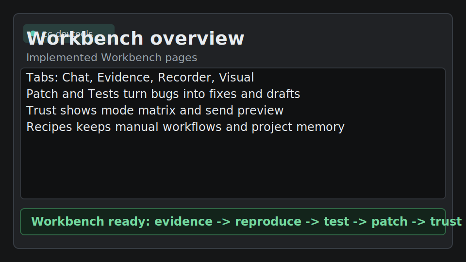

# cc-devtools

[](https://github.com/xuqinghuan675/cc-devtools/actions/workflows/ci.yml)
[](LICENSE)
[](pyproject.toml)
[](https://developer.chrome.com/docs/devtools)

把任意 CLI Agent 接入 Chrome F12 DevTools。



| Bridge 已连接 | Network 证据 | JSON 补丁并验证 |
|---|---|---|
|  |  |  |


cc-devtools 让 Claude Code、Codex、本地 LLM CLI 和其他终端 AI 工具可以直接在 F12 里工作：检查真实页面、收集 Console/Network/DOM 证据、记录 bug 复现流程、生成 Playwright 草稿、预览补丁事务、诊断 DOM 可点击性，并保存本地项目 Recipes。

它补充 MCP 和 Playwright MCP 流程：MCP 很适合做工具后端，而 cc-devtools 把操作者界面和结构化证据闭环直接放进 Chrome F12。

> 不再手动把 DOM、console 报错、network 失败、截图和源码片段复制给 AI。让 AI 从 DevTools 里收集结构化证据。

[English README](README.md) | [快速开始](docs/QUICKSTART.md) | [Demo 脚本](docs/DEMO_SCRIPT.md) | [使用场景](docs/USE_CASES.md) | [安全说明](SECURITY.md) | [贡献指南](CONTRIBUTING.md)

## 当前状态

第一版 Workbench 已初步完成。Plan 0-7 已实现并有自动化测试覆盖：

- Plan 0：Workbench 外壳、面板同步护栏、核心数据模型、脱敏 helper、Safety Kernel。
- Plan 1：Evidence Board，支持筛选、选择、复制，以及脱敏后的发送预览。
- Plan 2：Bug Flight Recorder，使用 2 分钟 / 300 事件 / 1 MB 的 ring buffer，并可生成 BugBundle。
- Plan 3：Playwright Test Generator，从选中证据生成只复制、不写文件的测试草稿。
- Plan 4：Patch Transaction，支持预览、备份、应用、人工验证和回滚状态机。
- Plan 5：Visual + DOM Diagnostics，不依赖截图权限即可诊断 DOM、样式、遮挡和可点击性。
- Plan 6：Trust Mode 页面和统一 Send Preview。
- Plan 7：Recipes + Project Memory，支持手动导入导出。

项目仍是 early alpha。加载扩展后建议先做真实 Chrome DevTools 面板手工验收，尤其是在重要项目上启用文件写入之前。

## 为什么不是“又一个浏览器工具”

- **不需要新的 API key**：直接使用你已经在终端里运行的 CLI AI，例如 Claude Code、Codex、本地 LLM CLI 或自定义 agent。
- **任意 CLI AI 接入 F12**：bridge 对 DevTools 面板走 WebSocket，对 agent 走 stdin/stdout，不绑定单一托管模型厂商。
- **DevTools 原生证据链**：页面文本、DOM、console、network、selector 和本地前端上下文集中在一个 Workbench 里。
- **结构化调试闭环**：证据、复现、测试草稿、补丁事务、验证和信任控制是独立页面，而不是堆进一个巨大聊天框。
- **不同于 MCP-only 流程**：MCP 适合做工具后端；cc-devtools 把操作者界面直接放进 Chrome F12。
- **不同于 Playwright MCP**：Playwright 更适合脚本化自动化；cc-devtools 更偏交互式调试、本地文件补丁和浏览器验证闭环。
- **不用手写 CDP glue**：可以直接要求检查、生成 selector、点击、输入和验证，不必手写 Chrome DevTools Protocol 脚本。

## Workbench 页面

| 页面 | 功能 |
|---|---|
| Chat | 默认入口。保留已有聊天和 `[ACTION:*]` 行为。 |
| Evidence | 结构化证据板，支持 console、network、DOM、action、project、file、verification、manual 证据。选中证据会作为普通用户消息发送，并经过脱敏和发送摘要。 |
| Recorder | Bug Flight Recorder，使用 ring buffer 记录 click、press、route/title 变化、输入摘要、console/network 摘要和 storage key diff。 |
| Visual | DOM 诊断：元素摘要、rect、computed style、disabled、pointer-events、overflow chain、中心点和 `elementFromPoint` 遮挡检查。截图能力以状态显示，第一版不强依赖截图。 |
| Patch | 保守的补丁事务页：已知文件路径 + 完整新内容。先读备份、展示 diff，再通过 bridge 应用，支持人工验证和回滚。 |
| Tests | 从选中 action 证据和 BugBundle 上下文生成 Playwright 草稿，只复制，不写文件。 |
| Trust | 产品化 Trust Mode：Observe Only、Debug Safe、Patch Sandbox。显示权限矩阵和最近一次 Send Preview。 |
| Recipes | 手动维护 workflow recipe 和 Project Memory：ignored console patterns、known selectors、common flows、API contracts、QA checklists。导入导出使用校验过的 JSON。 |

## 30 秒 Demo

运行内置 demo：

```bash
cc-devtools-demo
cc-devtools-demo --live
```

`--live` 会同时启动 demo 页面和 bridge，并尝试自动打开浏览器。如果浏览器没有自动打开，手动访问 `http://localhost:5173`。

按 F12，打开 **cc-devtools** 面板，选择 **Frontend Loop**，点击 demo 页面里的 **Copy prompt**，然后输入：

```text
Add Singapore to the country selector. Use the local JSON file, then select it and verify it in the page.
```

agent 可以：

1. 检查真实页面里的国家下拉框。
2. 使用附带的项目扫描结果理解文件、脚本和数据候选位置。
3. 读取 `public/cc-devtools/countries.json`。
4. 把 Singapore 写入本地 JSON 文件。
5. 重新加载页面数据。
6. 选择 Singapore 并点击 **Verify**。
7. 把 `#verification-output` 作为浏览器证据返回。

## 工作原理

```text
Chrome F12 Panel
   <-> WebSocket ws://localhost:9876
      <-> cc-devtools bridge
         <-> CLI AI 命令，例如 cc -p

面板提供 DevTools 动作：
DOM、text、eval、console、network、页面 click/input/press、storage、
project scan、file list/read，以及显式开启后的本地写入。
```

cc-devtools 自身不需要 API key。它启动你配置的 CLI AI 命令，并发送结构化页面上下文和工作流提示。

## 快速开始

### Windows 两步

1. 下载或 clone 本仓库，然后双击 `install.bat`。
   安装器会安装 Python bridge、生成本地 bridge token、检测 `cc` 或 `claude`、停止旧的 `9876` 端口监听、启动 `start-bridge.bat`、打开 `chrome://extensions`，并打开本地 `extension` 文件夹。
2. 在 Chrome 里开启 **Developer mode**，点击 **Load unpacked**，选择刚打开的 `extension` 文件夹。

然后打开任意网页，按 **F12**，选择 **cc-devtools** 标签页，把 `install.bat` 或 `start-bridge.bat` 打印出来的 token 粘贴到面板 **Token** 字段，点击 **Save**，即可聊天。

### 命令行安装

```bash
pip install git+https://github.com/xuqinghuan675/cc-devtools.git
cc-devtools
cc-devtools-path
```

如果你想从某个前端项目根目录手动启动 bridge，可以使用命令行方式。

更详细的 Windows 步骤和排错见 [docs/QUICKSTART.md](docs/QUICKSTART.md)。

## Workflow 模式

| 模式 | 适用场景 |
|---|---|
| Inspect | 理解页面结构、内容、表单、按钮和关键 UI 流程 |
| Debug | 诊断 console 报错、接口失败、按钮无响应或数据缺失 |
| Selector | 生成稳定的 Playwright locator 和 CSS selector |
| QA | 对真实页面做轻量发布验收 |
| Local Data Patch | 读取/写入本地项目文件，让前端使用本地 mock 数据 |
| Frontend Loop | 跑完整的真实页面 -> 项目上下文 -> 文件 patch -> 浏览器验证闭环 |

工作流提示词位于 [`cc_devtools/skills/frontend-devtools-workflows`](cc_devtools/skills/frontend-devtools-workflows/SKILL.md)。

## Trust 和权限

顶部下拉仍会给 CLI 发送权限模式：

| CLI 模式 | 发给 CLI 的参数 |
|---|---|
| Auto | `--permission-mode auto` |
| Plan | `--permission-mode plan` |
| Bypass | `--permission-mode bypassPermissions` |

Trust 页面控制面板侧 action 行为：

| Action | Observe Only | Debug Safe | Patch Sandbox |
|---|---|---|---|
| DOM/text/title/url | allow | allow | allow |
| console/network | allow | allow | allow |
| click/input/press | block | allow | allow |
| eval | block | confirm | confirm |
| file:list/project:scan | block | allow | allow |
| file:read | block | confirm | allow |
| save/write | block | block | allow |
| storage:get/list | block | allow | allow |
| storage:set/remove | block | confirm | confirm |

权限模式不会开启本地文件写入。无论 Python bridge 还是 Node bridge，`[ACTION:save]` / `write_file` 仍然必须设置 `CC_DEVTOOLS_ENABLE_WRITE=1`。

普通发送可以显示 Send Preview，包含 evidence、console、network、file content、page context、action results、estimated tokens 和 redaction 状态。action-result 自动回传不会弹预览，以免打断自动验证循环。

## 可用动作

| 动作 | 说明 |
|---|---|
| `[ACTION:eval]code[/ACTION]` | 在 inspected page 中执行 JavaScript |
| `[ACTION:dom]selector[/ACTION]` | 返回第一个匹配元素的 `outerHTML` |
| `[ACTION:dom:all]selector[/ACTION]` | 返回分页后的匹配元素 |
| `[ACTION:dom:all]{"selector":"button","offset":0,"limit":25,"format":"summary"}[/ACTION]` | 返回分页 DOM 摘要 |
| `[ACTION:text]selector[/ACTION]` | 返回元素可见文本 |
| `[ACTION:click]selector[/ACTION]` | 点击 inspected page 中匹配的元素 |
| `[ACTION:input]selector\ntext[/ACTION]` | 设置输入控件值并触发 input/change 事件 |
| `[ACTION:press]key[/ACTION]` | 向 active element 发送 keydown/keyup |
| `[ACTION:console][/ACTION]` | 返回最近 console 日志 |
| `[ACTION:network][/ACTION]` | 返回最近 network 请求和稳定 session 内 ID |
| `[ACTION:network]{"id":1,"detail":true,"bodyLimit":12000}[/ACTION]` | 返回 request headers、timing、post data 和 response preview |
| `[ACTION:title][/ACTION]` | 返回页面标题 |
| `[ACTION:url][/ACTION]` | 返回当前 URL |
| `[ACTION:copy]text[/ACTION]` | 渲染一个用户点击复制按钮和 fallback 可选中文本 |
| `[ACTION:storage:list]localStorage[/ACTION]` | 列出 `localStorage`、`sessionStorage` 或可见 cookie key |
| `[ACTION:storage:get]{"area":"localStorage","key":"theme"}[/ACTION]` | 读取浏览器 storage 值 |
| `[ACTION:storage:set]{"area":"sessionStorage","key":"debug","value":"1"}[/ACTION]` | 经确认后写入浏览器 storage |
| `[ACTION:storage:remove]{"area":"cookie","key":"debug"}[/ACTION]` | 经确认后删除浏览器 storage |
| `[ACTION:project:scan][/ACTION]` | 汇总本地前端框架、bundler、scripts、配置、关键目录、数据/service 候选、依赖和入口文件 |
| `[ACTION:file:list]pattern[/ACTION]` | 列出 bridge 写入根目录内的本地项目文件 |
| `[ACTION:file:read]path[/ACTION]` | 读取 bridge 写入根目录内的本地项目文件 |
| `[ACTION:save]path\ncontent[/ACTION]` | 设置 `CC_DEVTOOLS_ENABLE_WRITE=1` 后写入 bridge 写入根目录内的本地文件 |

文件动作只能访问 `CC_DEVTOOLS_WRITE_ROOT`，或启动 bridge 时所在目录。即使在允许目录内，`.env`、私钥文件、`.npmrc`、`.git/config` 等敏感文件也会被拒绝。

## 从源码安装

```bash
git clone https://github.com/xuqinghuan675/cc-devtools.git
cd cc-devtools
pip install -e .
cc-devtools
```

Node bridge 备选路径：

```bash
cd bridge
npm install
node server.js
```

Node bridge 是备选方案，但它使用同样的默认 `auto` 权限模式、`CC_DEVTOOLS_TOKEN` 检查、敏感文件拒绝和 `CC_DEVTOOLS_ENABLE_WRITE=1` 写入开关。

## 配置

| 环境变量 | 默认值 | 说明 |
|---|---|---|
| `CC_DEVTOOLS_CMD` | `cc` | 要运行的 CLI AI 命令 |
| `CC_DEVTOOLS_PORT` | `9876` | 本地 WebSocket 端口 |
| `CC_DEVTOOLS_WRITE_ROOT` | 当前工作目录 | 文件动作允许读取，以及显式开启后写入的目录 |
| `CC_DEVTOOLS_ENABLE_WRITE` | 未设置 | 设置为 `1` 后启用 `[ACTION:save]` / `write_file` |
| `CC_DEVTOOLS_PERMISSION_MODE` | `auto` | 面板未发送权限模式时的默认 CLI 权限模式 |
| `CC_DEVTOOLS_TOKEN` | `install.bat` 生成；否则未设置 | 配置后 bridge 会要求共享 token |
| `CC_DEVTOOLS_ALLOWED_ORIGINS` | `chrome-extension://*` 行为 | 可选逗号分隔的精确 Origin 或 `prefix*` 模式 |
| `CC_DEVTOOLS_BYPASS` | 未设置 | 旧兼容开关；仅在面板未发送权限模式时作为 `bypassPermissions` fallback |

## 安全模型

- 只在你信任的页面上使用这个扩展。
- 页面文本、DOM 片段、console 日志、network 摘要、action 结果、选中证据、BugBundle、测试草稿，以及通过 `[ACTION:file:read]` 读取的本地文件内容，可能会发送给你的 CLI AI 进程。
- 发送给 CLI AI 前，来自浏览器的上下文会被标记为不可信 prompt 数据。
- 页面 URL、正文、DOM、console、network URL、action 结果、Evidence、Recorder 事件、Recipes 和 Project Memory 中匹配常见 key 名的 token-like 值会被脱敏。
- Recorder 的 input 事件默认只保存 selector 和 value 摘要，不保存完整输入值。
- `[ACTION:eval]` 会在当前 inspected page 中执行 JavaScript。
- 页面交互动作可以在当前页面点击、输入或按键。
- `[ACTION:project:scan]` 会读取 bridge 写入根目录内的本地项目元数据。
- 文件动作不能离开配置的写入根目录，根目录内的敏感文件也会被拒绝。
- 文件写入默认关闭；只建议在一次性或可信项目根目录中显式开启。
- `install.bat` 会生成 `CC_DEVTOOLS_TOKEN`，写入 `start-bridge.bat`，并要求你在 DevTools 面板中保存。
- 每条用户消息的自动 action-result 循环会在配置的轮数上限停止。
- DevTools 面板会在渲染普通 AI 回复前转义 HTML，同时保留合法 action block。

完整安全说明见 [SECURITY.md](SECURITY.md)。

## 项目状态

cc-devtools 目前是 early-stage alpha。Python bridge 是主路径；Node bridge 是给偏好 Node.js 的用户保留的备选方案。

初版 Workbench 功能已初步完成并有测试覆盖。下一步硬化方向是真实 DevTools 面板 smoke test、更完整的截图能力、iframe/shadow DOM 诊断，以及自定义 Send Preview modal。

适合贡献的方向：

- 每个 Workbench 页面真实截图或短视频
- 更多框架下的本地数据 patch 示例
- React、Vue、Next.js、Vite 的点击/输入验证示例
- Chrome extension 可访问性和键盘操作 polish

## 相关资料

- [Chrome DevTools 文档](https://developer.chrome.com/docs/devtools)
- [Chrome DevTools Local Overrides](https://developer.chrome.com/docs/devtools/overrides)
- [Playwright locators](https://playwright.dev/docs/locators)
- [GitHub README 指南](https://docs.github.com/en/repositories/managing-your-repositorys-settings-and-features/customizing-your-repository/about-readmes)

## License

MIT
